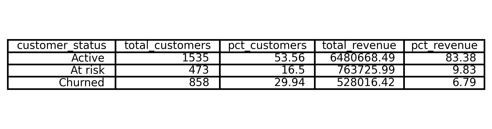
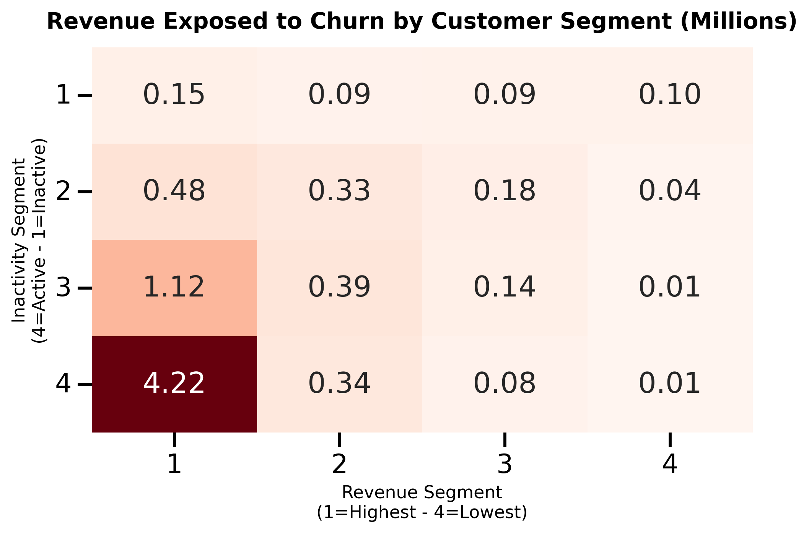

# Retail Customer Churn Analysis

Dataset: Online Retail II (UCI Repository)

### Background & Objective

The Online Retail II dataset contains transactional data from a UK based e-commerce company (2009–2011).

In repeat purchase businesses, customer inactivity eventually translates into future revenue loss. However, churn rate alone does not quantify financial exposure.

This project reframes churn from a business perspective:

Not “How many customers are leaving?”
But “Where is revenue becoming vulnerable and when?”

The objective is to identify where revenue is truly at risk and which customer segments should be prioritized to protect it.

Technical Scope:

- Python for data cleaning and KPI engineering
- MySQL for churn definition and revenue segmentation
- SQL window functions for revenue quartile analysis
- Custom KPI design: Revenue at Risk & Churn Concentration

## Data Structure Overview

The analysis was built in MySQL using two core relational tables designed to transform transactional data into customer level revenue insights.

customers (Customer level analytical table)
This table enables churn classification and revenue exposure analysis (One row per customer).

- customer_id (Primary Key)
- first_purchase_date
- last_purchase_date
- days_since_last_purchase
- churn_eligible
- customer_status (Active / At Risk / Churned)
- total_revenue
- total_invoice

Customer status was derived using inactivity thresholds:

- Active: < 70 days since last purchase
- At Risk: 70–174 days
- Churned: ≥ 175 days

transactions (Transactional level table)
This table serves as the base for revenue aggregation and behavioral analysis (One row per invoice line).

- transaction_id (Primary Key)
- invoice
- stock_code
- description
- quantity
- price
- invoice_date
- customer_id (Foreign Key → customers)
- country

Relationship
transactions.customer_id → customers.customer_id

## Executive Summary

29.9% of churn eligible customers have stopped purchasing.

Yet they represent only 6.8% of total revenue.

The real financial risk is not churn volume, it is revenue concentration.

Revenue remains heavily concentrated among a small group of high value customers. When these customers enter early inactivity (70–174 days), a disproportionate share of revenue becomes vulnerable.

This analysis shifts churn from a volume metric to a revenue exposure framework, identifying where financial risk truly begins and where retention efforts generate the highest ROI.

#### Revenue Distribution by Customer Status

Although nearly 30% of churn eligible customers have churned, 83% of total revenue remains concentrated among active customers.

The critical transition occurs when high value customers move from Active to At Risk, marking the beginning of meaningful revenue vulnerability.

#### Revenue Exposure by Value & Inactivity Stage

Revenue is highly concentrated within the top quartile.

When customers in this segment enter in early inactivity (70–174 days), a disproportionate share of total revenue becomes vulnerable.

This stage represents the highest ROI intervention window.

#### Geographic Revenue Concentration

Revenue is heavily concentrated in the United Kingdom.

However, Ireland (Eire) generates €356K in revenue from only 5 customers.

This creates structural dependency risk:

- Revenue is highly concentrated in a minimal customer base.
- Losing a single Irish customer would materially impact total revenue.
- Churn metrics alone fail to capture this exposure.
- Irish market require relationship driven retention strategies.

Geographic revenue weighting reveals strategic dependency that traditional churn analysis would overlook.

## Key Business Insights

- Revenue concentration is driven by top quartile customers.
- High churn volume does not necessarily imply high revenue loss.
- Early inactivity (70–174 days) is the optimal intervention window.
- Revenue based segmentation outperforms volume based retention targeting.
- Geographic concentration (e.g., Ireland/Eire) indicates revenue retention opportunities.

## Strategic Recommendation

- Prioritize high revenue customers entering in early inactivity.
- Shift retention strategy from churn rate reduction to proactive revenue at risk protection.
- Align retention investment proportionally to customer revenue contribution.
- Reduce geographic revenue concentration risk by prioritizing relationship-based retention in high-intensity markets (e.g., Ireland).

## Final Insight

- Churn is often treated as a customer retention metric.
- This analysis demonstrates that it is fundamentally a revenue concentration problem.
- The greatest financial risk does not occur when customers leave, it begins when high value revenue starts to disengage.
- Protecting revenue requires identifying early vulnerability, not just measuring churn.